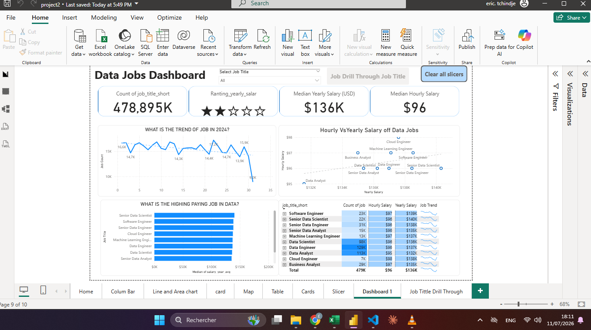
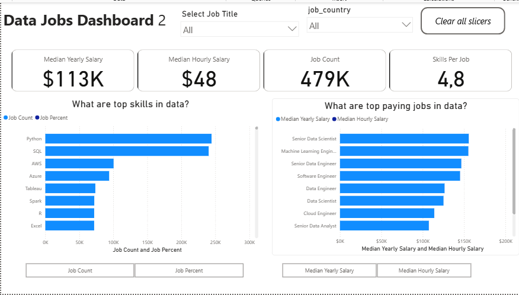

# 📊 Power BI for Data Analytics - Full Course

Learning powerbi through real hand ons project : Analyse data job

### First Project
Dashboard to view job  with drill Through feature to view detail selected job  

Skill learn
- Differents Charts, slicer, spark line, selection, button action,...
- Edit interaction, Drill Through, Dasboard design principe, ...
- Measure, modeling, power query, optimization tips...

This project was a journey through key Power BI features. Here's a look at what we mastered:

-   **⚙️ Data Transformation (ETL) with Power Query:** Cleaned, shaped, and prepared the raw data for analysis by handling blanks, changing data types, and creating new columns.
-   **Implicit Measures:** Formulated measures to derive key insights and KPIs like `Median Yearly Salary` and `Job Count`.
-   **Core Charts:** Utilized **Column, Bar, Line,** and **Area Charts** to compare job counts and track trends over time.
-   **Geospatial Analysis:** Leveraged **Map Charts** to visualize the global distribution of jobs.
-   **KPI Indicators & Tables:** Used **Cards** to display key metrics and **Tables** to provide granular, sortable data.
-   **Dashboard Design:** Designed an intuitive and visually appealing layout, exploring both common and uncommon chart types to best tell the data story.
-   **🖱️ Interactive Reporting:**
    -   **Slicers:** To dynamically filter the report by Job Title.
    -   **Buttons & Bookmarks:** To create a seamless navigation experience.
    -   **Drill-Through:** To navigate from a high-level summary to a contextual, detailed view.
---

#### Dasboard

#### Job Detailed through Drill Through powerbi feature

### Second Project

live link :

build second  dashboard that show the skill and and focus on the more interesting thing about 
deep analysis of paying job by skill and salary.

concepts :
- DAX syntaxe,
- Dimensional modeling of data (fact and dimensional model)
- Parameter
- row, query and  filter context

Skill :
This project put key Power BI features into practice. Here's what we mastered:
* **Dashboard Design:** Crafting an intuitive and visually appealing report layout.
* **Power Query ETL:** Performing data cleaning, shaping, and transformation.
* **Data Modeling:** Building efficient data models with relationships (Star Schema principles).
* **DAX Fundamentals:** Creating calculations and aggregations to derive key insights.
* **Visualizations Utilized:**
    * **Core Charts:** Column, Bar, Line, and Area charts for comparisons and trends.
    * **Map Charts:** For displaying geospatial data.
    * **Cards:** To highlight key performance indicators.
    * **Tables:** For presenting detailed, tabular information.
    * **Chart Variety:** Selecting from common and uncommon chart types for effective storytelling.
* **🖱️ Interactive Features:**
    * **Slicers:** Enabling dynamic, user-driven data filtering.
    * **Buttons & Bookmarks:** For streamlined navigation and managing report views (including Drill-Through).
---

#### Dashboard 2

